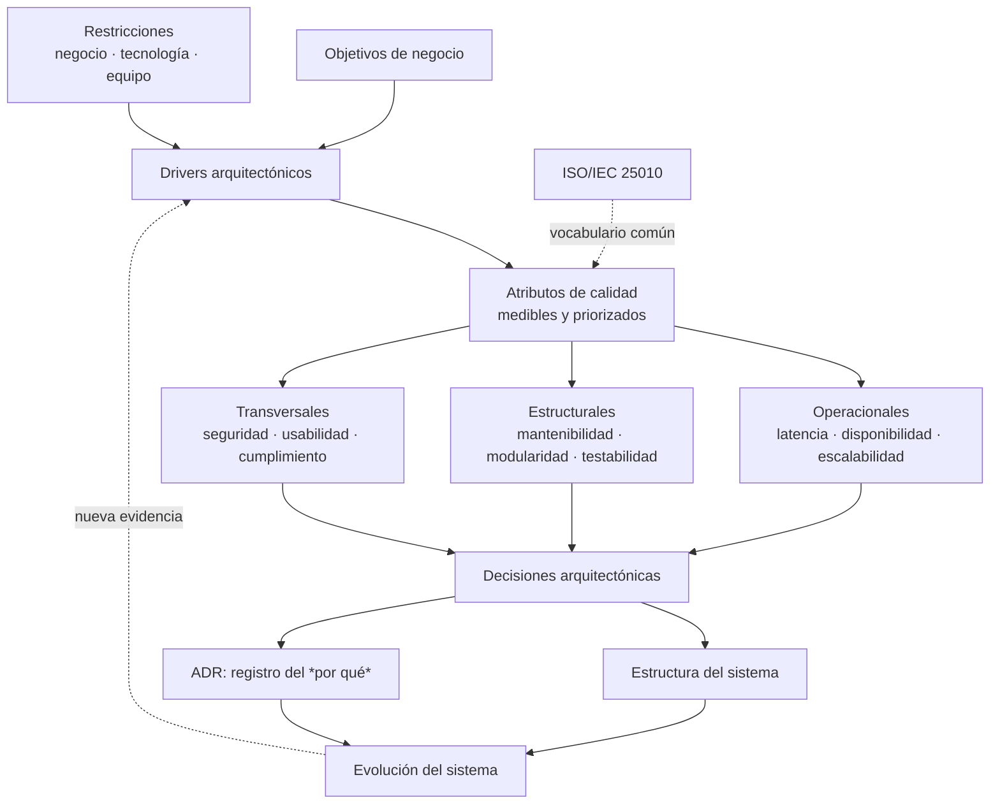

# Módulo 1 — Análisis de apertura

> Convención de este documento:
> **[CURSO]** = está en el material del diplomado · **[COMPL]** = conocimiento complementario ·
> **[RECOM]** = mi recomendación como arquitecto.

---

## 1. Objetivo del módulo y por qué importa

**[CURSO]** El módulo establece los fundamentos que hacen de la arquitectura "el cimiento de
sistemas robustos y escalables", y su **papel estratégico**: alinear soluciones tecnológicas con
objetivos de negocio. Cierra con atributos de calidad e ISO/IEC 25010.

**[COMPL]** Traducido a lo que realmente enseña este módulo: **la arquitectura es el conjunto de
decisiones difíciles de revertir.** Todo lo demás es diseño. Un `if` mal puesto se arregla en una
tarde; elegir consistencia fuerte donde el negocio necesitaba disponibilidad se paga durante años.
Por eso el módulo insiste en *análisis temprano* — el costo de cambiar una decisión crece de forma
no lineal con el tiempo.

**[RECOM]** Este módulo es la base de vocabulario de todo el diplomado. Si sales de aquí sabiendo
nombrar y cuantificar atributos de calidad, los módulos 2–4 (que por los complementarios se ven
como resiliencia, despliegue, seguridad y cloud) van a ser mucho más fáciles.

---

## 2. Conceptos principales

### A. Las tres dimensiones de importancia de la arquitectura **[CURSO]**

| Dimensión | Qué significa | Por qué es difícil |
|---|---|---|
| **Estructuración de la complejidad** | Descomponer el sistema en partes con límites claros | El límite mal puesto se paga en acoplamiento para siempre |
| **Análisis temprano de atributos de calidad** | Evaluar rendimiento, seguridad, etc. *antes* de construir | Los atributos de calidad no se "añaden" después; se diseñan |
| **Toma de decisiones técnicas informadas** | Decidir con criterio y dejar rastro del *por qué* | Nadie documenta el por qué, y entonces nadie puede revisarlo |

### B. Los cuatro componentes de una arquitectura **[COMPL — Richards y Ford, cap. 1]**

El módulo dice que la arquitectura es "un conjunto dinámico de elementos interrelacionados".
Richards y Ford — bibliografía oficial del módulo — lo concretan en cuatro:

```text
Arquitectura = Estructura            (estilo: microservicios, capas, monolito modular…)
             + Características       (atributos de calidad que debe cumplir)
             + Decisiones            (reglas duras sobre cómo se construye)
             + Principios de diseño  (guías, no reglas: "preferir async cuando sea posible")
```

La diferencia entre **decisión** y **principio** es fina y examinable:
la decisión es obligatoria (*"solo la capa de negocio accede a la base de datos"*),
el principio es una guía con margen (*"preferir mensajería a llamadas síncronas"*).

### C. Las leyes de la arquitectura de software **[COMPL — Richards y Ford]**

El material referencia "las leyes fundamentales" pero el detalle vive en el Genially 2, que no
quedó descargado. Las de Richards y Ford son:

- **Primera ley:** *Todo en arquitectura de software es un trade-off.*
- **Corolario 1:** *Si crees que encontraste algo que no es un trade-off, es que todavía no
  identificaste el trade-off.*
- **Segunda ley:** *El "por qué" importa más que el "cómo".*

> ⚠️ **Verificar contra el Genially 2** antes de la autoevaluación. Es posible que el docente use
> otra formulación o añada leyes propias.

### D. Restricciones: los tres frentes **[CURSO]**

```text
NEGOCIO            TECNOLOGÍA              EQUIPO / RECURSOS
presupuesto        stack heredado          tamaño del equipo
time-to-market     licencias               experiencia disponible
regulación         nube contratada         madurez operativa
contratos con      capacidad de la red     rotación de personal
terceros           límites del proveedor   presupuesto de tiempo
```

**[RECOM]** La restricción más subestimada es la del **equipo**. Una arquitectura de
microservicios con event sourcing es correcta en el papel y catastrófica con un equipo de cuatro
personas sin experiencia en sistemas distribuidos. Conway y la "restricción de equipo" son la
razón por la que la mejor arquitectura sobre el papel puede ser la peor decisión en la práctica.

### E. Clasificación de características arquitectónicas **[CURSO + COMPL]**

**[CURSO]** El módulo declara tres categorías: **operacionales**, **estructurales** y
**transversales**. **[COMPL]** Con el desglose de Richards y Ford:

| Categoría | Qué mide | Ejemplos |
|---|---|---|
| **Operacionales** | Cómo se comporta el sistema en producción | disponibilidad, rendimiento, **latencia**, escalabilidad, elasticidad, recuperabilidad, continuidad de negocio (RTO/RPO) |
| **Estructurales** | Cómo está construido el código | modularidad, mantenibilidad, extensibilidad, portabilidad, capacidad de despliegue, testabilidad, reutilización |
| **Transversales** | No caben en ninguna de las dos | seguridad, usabilidad, accesibilidad, privacidad, cumplimiento normativo, autenticación, autorización |

**[RECOM]** La regla práctica que vale más que la taxonomía: **un atributo de calidad que no se
puede medir no es un atributo de calidad, es un deseo.** "El sistema debe ser rápido" no sirve.
"p99 de la respuesta del endpoint de pago < 200 ms con 500 rps" sí. Esto es exactamente lo que
te va a pedir la actividad del módulo.

### F. ISO/IEC 25010 **[CURSO + COMPL]**

**[CURSO]** El material cita **ISO/IEC 25010** en la sección de recursos y en las conclusiones,
pero en el texto de la sección "Cierre" dice *"estándares como ISO/IEC 25000"*.

**[COMPL]** No es lo mismo y conviene tenerlo claro:
- **ISO/IEC 25000** es la **familia** completa (SQuaRE — *Systems and software Quality
  Requirements and Evaluation*).
- **ISO/IEC 25010** es el **modelo de calidad** dentro de esa familia. Es el que lista las
  características.

**[COMPL]** Las **8 características** de ISO/IEC 25010:**2011** — la versión que cita el módulo:

| # | Característica | Subcaracterísticas (resumen) |
|---|---|---|
| 1 | Adecuación funcional | completitud, corrección, pertinencia |
| 2 | Eficiencia de desempeño | comportamiento temporal, uso de recursos, capacidad |
| 3 | Compatibilidad | coexistencia, interoperabilidad |
| 4 | Usabilidad | aprendizaje, operabilidad, protección ante error, estética, accesibilidad |
| 5 | Fiabilidad | madurez, **disponibilidad**, tolerancia a fallos, recuperabilidad |
| 6 | Seguridad | confidencialidad, integridad, no repudio, responsabilidad, autenticidad |
| 7 | Mantenibilidad | modularidad, reusabilidad, analizabilidad, modificabilidad, testabilidad |
| 8 | Portabilidad | adaptabilidad, instalabilidad, reemplazabilidad |

> ⚠️ **[COMPL]** ISO/IEC 25010 fue **revisada en 2023** y la versión vigente tiene **9**
> características: se añade *Safety*, *Usability* pasa a llamarse *Interaction Capability*, y
> *Portability* se absorbe en una nueva característica *Flexibility*. **El material del diplomado
> cita la de 2011.** Para la autoevaluación, responde según **2011 (8 características)**; pero
> saber que existe la revisión es exactamente el tipo de precisión que distingue a un arquitecto.
> Vale confirmarlo en iso25000.com antes de citarlo en una entrega.

---

## 3. Mapa conceptual del módulo



La flecha que más importa es la de retorno: **la arquitectura no se decide una vez.** El módulo lo
dice explícitamente — las decisiones "configuran el sistema desde su creación pero también impactan
su evolución a lo largo del tiempo".

---

## 4. Conocimientos previos

Lo que el módulo asume y conviene tener firme:

| Concepto | ¿Por qué se necesita aquí? |
|---|---|
| Requerimientos funcionales vs. no funcionales | Los atributos de calidad **son** los no funcionales |
| Cliente–servidor, TCP/UDP, sockets | Indispensable para la actividad de latencia |
| Percentiles (p50, p95, p99) frente a promedio | Sin esto la medición de la actividad no vale |
| Nociones de concurrencia y I/O bloqueante vs. no bloqueante | La latencia se gana o se pierde aquí |
| Acoplamiento y cohesión | Base de la dimensión "estructuración de la complejidad" |

**[RECOM]** El único que suele faltar es el de **percentiles**, y es el que decide la nota de la
actividad. Si el promedio de tu latencia es 0.4 ms pero el p99.9 es 12 ms, tu sistema **no** cumple
"menor a 1 milisegundo" — y decirlo tú antes de que lo diga el evaluador es lo que demuestra criterio.

---

## 5. Aplicación en sistemas reales

- **Sistemas de pago / financieros** *(el dominio del docente)*: la decisión temprana entre
  consistencia fuerte y eventual define el sistema entero. Un movimiento contable no admite
  eventual; un saldo mostrado en pantalla sí.
- **Trading y ultra baja latencia**: la actividad del módulo es una miniatura de esto — colocalización,
  kernel bypass, busy-spinning en lugar de interrupciones.
- **E-commerce**: disponibilidad sobre consistencia en el catálogo, lo contrario en el inventario final.
- **ERP**: la restricción dominante es el stack heredado, no la técnica.
- **SaaS multi-tenant**: aislamiento (transversal) y elasticidad (operacional) entran en conflicto directo.

---

## 6. Implicaciones arquitectónicas — el trade-off central del módulo

No hay una arquitectura buena; hay una **apropiada para unos atributos priorizados**. Y los
atributos compiten entre sí:

| Al maximizar… | …se degrada |
|---|---|
| Latencia (mínima) | Portabilidad, mantenibilidad, costo, simplicidad operativa |
| Disponibilidad | Consistencia (teorema CAP), costo |
| Seguridad | Rendimiento (cifrado, validación), usabilidad |
| Escalabilidad | Simplicidad, consistencia, facilidad de depuración |
| Time-to-market | Todo lo demás (deuda técnica) |

**[RECOM]** El error clásico del estudiante de arquitectura es intentar maximizar todo. El
ejercicio real es **elegir 3 o 4 atributos "driver"** y aceptar explícitamente que los demás
quedan en un nivel "suficiente". Eso es lo que un ADR documenta.

---

## 7. La actividad: lectura de arquitecto

El "Reto de Latencia Mínima" parece un ejercicio de programación. No lo es — es un ejercicio de
**definir el límite de medición y ser honesto sobre él**. Ver
`../Ejercicios/Reto-Latencia-Minima/ENUNCIADO.md` para el enunciado literal.

**[RECOM]** Tres cosas que valen más que el número:

1. **Declarar dónde empieza y termina la medición.** "Latencia" no significa nada sin frontera:
   ¿desde que la aplicación cliente llama a `send()` hasta que recibe el byte de vuelta? ¿Incluye
   serialización? ¿Es en la misma máquina o cruzando la red? El mismo sistema puede reportar
   200 ns o 20 ms según dónde pongas las sondas. **Esta es la decisión arquitectónica del ejercicio.**
2. **Reportar percentiles, no promedios**, con warmup previo y un histograma. El promedio esconde
   exactamente lo que importa en un sistema de baja latencia: la cola.
3. **Nombrar el trade-off que aceptaste.** Cada nanosegundo que ganas lo pagas en algo:
   acoplamiento al host, pérdida de portabilidad, consumo de CPU al 100%, imposibilidad de
   depurar. Un informe que diga *"logré 300 ns y esto es lo que sacrifiqué"* vale más que uno que
   solo diga *"logré 300 ns"*.

Escala de referencia **[COMPL]** — órdenes de magnitud, no promesas:

```text
Llamada a función en proceso          ~1–10 ns
Memoria compartida + busy-spin        ~50 ns – 1 µs
Socket de dominio Unix                ~10–20 µs
TCP en loopback                       ~20–50 µs
HTTP/1.1 en loopback                  ~50–200 µs
TCP en LAN (mismo datacenter)         ~100–500 µs
HTTP a través de internet             ~10–100 ms
```

**Conclusión incómoda pero útil:** el objetivo de "< 1 ms" se cumple con holgura con un socket TCP
en loopback. El reto **no** está en llegar al número, sino en demostrar que lo mediste bien y que
entiendes qué sacrificaste. Ahí es donde se separa el que programó de el que diseñó.

---

## 8. Preguntas que deberías poder responder al cerrar el módulo

1. ¿Cuál es la diferencia entre **arquitectura** y **diseño**? ¿Dónde está la frontera?
2. Enuncia la primera ley de la arquitectura de software y explica por qué su corolario es más útil que la ley misma.
3. ¿Cuáles son las tres dimensiones que definen la importancia de la arquitectura, según el módulo?
4. Diferencia **decisión arquitectónica** de **principio de diseño**, con un ejemplo de cada uno.
5. Clasifica en operacional / estructural / transversal: disponibilidad, testabilidad, no repudio, elasticidad, portabilidad, accesibilidad.
6. ¿Qué es ISO/IEC 25000 y qué es ISO/IEC 25010? ¿Cuántas características tiene el modelo de calidad y cuáles?
7. Nombra los tres frentes de restricciones y da un ejemplo real de cada uno.
8. ¿Por qué "el sistema debe ser seguro" no es un atributo de calidad utilizable? Reescríbelo para que lo sea.
9. Da un par de atributos de calidad que estén en **conflicto directo** y explica el trade-off.
10. ¿Por qué el análisis de atributos de calidad debe ser **temprano**? ¿Qué pasa si se hace al final?
11. ¿Qué es y para qué sirve un ADR? ¿Qué relación tiene con la segunda ley de la arquitectura?
12. En tu solución al reto de latencia: ¿dónde exactamente empieza y termina tu medición, y qué sacrificaste para llegar ahí?

---

## 9. Temas a investigar más

- **Genially 2** — lista exacta de "leyes de la arquitectura" según el docente (puede diferir de Richards y Ford).
- **Genially M1P5** — taxonomía completa de atributos de calidad tal como la presenta el módulo.
- **ISO/IEC 25010:2023** — confirmar el cambio de 8 a 9 características antes de citarlo formalmente.
- **Coordinated omission** (Gil Tene) — el error de medición más común en benchmarks de latencia; directamente aplicable a la actividad.
- **RTO / RPO** — no están en el temario del M1 pero los cuatro artículos de DR de AWS en los complementarios giran alrededor de ellos. Probable anticipo del módulo 2 o 3.
