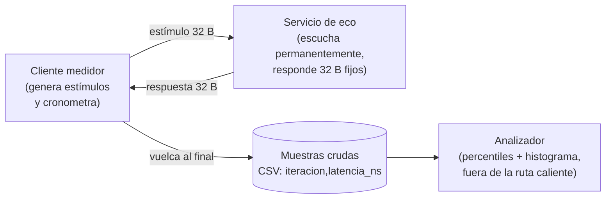
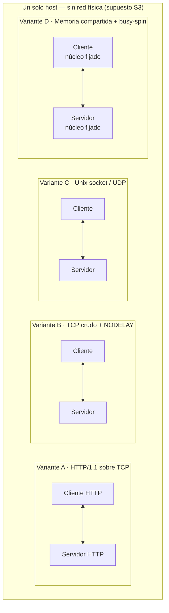

# Reto de Latencia Mínima — Diseño arquitectónico

> Documento raíz del ejercicio. Es la base del **entregable 2** (documentación técnica en PDF).
> Fecha: 2026-09-10 · Autor: Daniel Mazo Serna (Group 2)
>
> **Convención de fuentes**, exigida por el contrato del proyecto:
> **[DIP]** contenido del diplomado · **[COMP]** conocimiento complementario externo ·
> **[REC]** recomendación propia como arquitecto, discutible.

---

## 0. Por qué este documento existe antes que el código

El enunciado pide «diseña y construye». El reflejo natural es invertir el orden: construir,
medir, y escribir el documento al final para justificar lo que salió. Ese orden produce un
informe que describe un accidente, no una decisión.

**[DIP]** El temario del módulo es explícito en esto: la arquitectura son *decisiones* tomadas
contra *restricciones* para satisfacer *atributos de calidad*. La segunda ley de la arquitectura
—«el *por qué* importa más que el *cómo*»— no se puede cumplir a posteriori: si el porqué se
inventa después del resultado, es una racionalización, no una justificación.

Así que primero los drivers, luego las opciones, luego la decisión registrada, y solo entonces
el código.

---

## 1. Drivers arquitectónicos

Extraídos del enunciado literal (`ENUNCIADO.md`). **No hay drivers inventados aquí**: todo lo
que sigue es rastreable a una frase del enunciado o se marca explícitamente como supuesto.

| # | Driver | Origen textual | Tipo |
|---|---|---|---|
| D1 | Latencia de ida y vuelta **< 1 ms** | «preferiblemente menor a un milisegundo» | Atributo de calidad (operacional) |
| D2 | El sistema **escucha permanentemente** | «debe escuchar permanentemente peticiones» | Restricción funcional |
| D3 | Ante un estímulo, **retorna una respuesta específica** | «retornar una respuesta específica» | Requisito funcional |
| D4 | La latencia **debe medirse** | «debe medirse el tiempo transcurrido» | Requisito de observabilidad |
| D5 | Las herramientas **deben justificarse** | «justificación de herramientas, lenguajes y metodologías» | Restricción de proceso |
| D6 | Los resultados se **comparan contra 1 ms** | «comparación explícita con el objetivo de 1 ms» | Restricción de reporte |

### Lo que el enunciado NO pide — y es decisivo

Un ejercicio de arquitectura se define tanto por lo ausente como por lo presente. El enunciado
**no** exige:

- Concurrencia, ni varios clientes simultáneos → **no hay requisito de throughput.**
- Durabilidad, persistencia o recuperación ante fallos → **no hay requisito de disponibilidad.**
- Red física, ni siquiera dos máquinas → **el alcance puede ser un solo host.**
- Seguridad, autenticación o cifrado → **no hay superficie de amenaza declarada.**
- Un payload determinado, ni un protocolo determinado.

**[REC]** Esta lista es la defensa formal contra la sobreingeniería. Cada pieza que alguien
proponga añadir (Docker, un framework, un broker de mensajes, un balanceador) tiene que
justificarse contra *esta* lista, y ninguna de esas piezas reduce latencia: todas la aumentan.
El módulo penaliza conceptualmente la sobreingeniería, y aquí hay evidencia documental para
rechazarla.

### Supuestos declarados

Donde el enunciado calla, se decide y se declara. Estos son supuestos, no hechos:

| # | Supuesto | Alternativa descartada | Riesgo si el supuesto es falso |
|---|---|---|---|
| S1 | Estímulo y respuesta son mensajes de **tamaño fijo y pequeño** (32 B) | Payload variable o grande | Bajo: el orden de magnitud no cambia por debajo del MTU |
| S2 | **Un solo cliente**, una petición en vuelo | Carga concurrente | Medio: cambia la interpretación; se declara en el informe (§5) |
| S3 | Cliente y servidor **en el mismo host** | Red física entre dos máquinas | **Alto**: es la decisión que más baja el número. Ver §4 |
| S4 | Sistema **en reposo** durante la medición | Máquina con carga real | Medio: infla la cola. Se registra la carga (ESPEC §4) |

> **S3 es una trampa que hay que nombrar en voz alta, no esconder.** Medir en loopback elimina
> la red, que en un sistema real es el componente dominante de la latencia. Presentar 13 µs en
> loopback como «latencia del sistema» sin declarar que no hay red de por medio sería
> deshonesto. La honestidad sobre la frontera vale más que el número.

---

## 2. Atributos de calidad — escenarios medibles

**[DIP]** El módulo clasifica los atributos en **operacionales**, **estructurales** y
**transversales**, y sostiene que su valor está en el *análisis temprano*.
**[COMP]** El formato de escenario de seis partes (fuente · estímulo · artefacto · entorno ·
respuesta · medida de respuesta) es de Bass, Clements y Kazman, que es bibliografía declarada
del módulo.

Un atributo de calidad sin medida de respuesta no es un atributo: es un deseo. «Baja latencia»
no es verificable; lo que sigue sí.

### AC-1 · Latencia (operacional) — **atributo dominante**

| Parte | Valor |
|---|---|
| Fuente | Proceso cliente en el mismo host |
| Estímulo | Un mensaje de 32 bytes |
| Artefacto | Servicio de eco |
| Entorno | Operación normal, sistema en reposo, una petición en vuelo |
| Respuesta | El cliente recibe los 32 bytes de respuesta |
| **Medida** | **p99.9 del RTT < 1 ms**, medido en espacio de usuario del cliente |

> **[REC] La medida se expresa en p99.9, no en promedio ni en «latencia».** Esta es la primera
> decisión arquitectónica real del ejercicio y se justifica en §3. Un sistema cuya mediana es
> 13 µs pero cuyo máximo es 2,2 ms **incumple** el objetivo bajo una lectura estricta, y hay
> que decir cuál lectura se adoptó.

### AC-2 · Determinismo / predictibilidad (operacional)

| Parte | Valor |
|---|---|
| Estímulo | 1 000 000 de mensajes consecutivos |
| **Medida** | **Relación p99.9 / p50 ≤ 10** y ninguna muestra por encima de 1 ms |

**[REC]** Este atributo **no lo pide el enunciado; lo añado yo**, y es el que convierte el
ejercicio en arquitectura. En sistemas de baja latencia reales —trading, telecomunicaciones,
control industrial— el requisito nunca es «que sea rápido», es «que la cola sea acotada». El
hallazgo de la variante B (p50 = 13 µs, máx = 2 202 µs, relación **164×**) es precisamente el
incumplimiento de AC-2 con AC-1 aprobado. Ahí está el contenido del informe.

### AC-3 · Comparabilidad entre variantes (estructural, del *proceso* de medición)

| Parte | Valor |
|---|---|
| Estímulo | Cuatro implementaciones distintas del mismo servicio |
| **Medida** | Las cuatro producen el **mismo formato de muestras crudas** y sus métricas las calcula **un único script** |

**[REC]** Sin este atributo el estudio comparativo no existe: cuatro personas calculando sus
propios percentiles producen cuatro números incomparables. Está materializado en el contrato
del harness (`harness/README.md`) y es la razón de que `analyze.py` sea único y no replicable.

### AC-4 · Trazabilidad de la evidencia (transversal)

| Parte | Valor |
|---|---|
| **Medida** | Toda cifra del informe es reproducible desde un CSV crudo versionado + el entorno registrado (CPU, SO, kernel, runtime) |

**[REC]** El enunciado pide logs de ejecución (entregable 3). Esto lo eleva de «pegar una
captura» a «la evidencia sostiene la conclusión».

### Atributos explícitamente **sacrificados**

**[DIP]** Primera ley de la arquitectura: *todo es un trade-off*. Declarar lo que se sacrifica
es lo que separa una decisión de una omisión.

| Atributo | Se sacrifica | A cambio de |
|---|---|---|
| **Portabilidad** | La variante D depende del sistema operativo y de la arquitectura de CPU | Latencia de ~2 órdenes de magnitud menos |
| **Escalabilidad** | Un solo cliente; busy-spin ocupa un núcleo al 100 % | Eliminar el despertar del planificador |
| **Eficiencia de recursos** | Un núcleo quemado al 100 % sin hacer trabajo útil | Determinismo en la cola |
| **Interoperabilidad** | Memoria compartida solo funciona entre procesos del mismo host | Evitar la pila de red completa |
| **Mantenibilidad** | Código de bajo nivel, difícil de modificar con seguridad | Control sobre cada asignación y cada copia |
| **Seguridad** | Sin autenticación, sin cifrado, sin validación de entrada | No hay superficie de amenaza en el alcance declarado |

> Esta tabla **es** la respuesta a la pregunta «¿por qué no usan esto en producción para todo?».
> Y es el guion del video de 5 minutos.

---

## 3. La decisión central: dónde empieza y termina la medición

**[REC]** Si este ejercicio tiene una sola decisión arquitectónica, es esta. No es el lenguaje,
no es el transporte: es **dónde se ponen las sondas**.

El mismo sistema, sin cambiar una línea, reporta números distintos según la frontera:

```text
  ┌──────────────────── PROCESO CLIENTE ─────────────────────┐   ┌─── PROCESO SERVIDOR ───┐
  │                                                           │   │                        │
  │  (F4) arranque del proceso                                │   │                        │
  │   │                                                       │   │                        │
  │  (F3) establecimiento de conexión                         │   │                        │
  │   │                                                       │   │                        │
  │  (F1)─┬─ t0 ── escritura ──┐                              │   │                        │
  │       │                    └────── transporte ────────────┼──▶│ lectura                │
  │       │                                                   │   │ (sin lógica)           │
  │       │   ┌──────────────────────── transporte ───────────┼───│ escritura              │
  │  (F1)─┴─ t1 ◀─ lectura completa ─┘                        │   │                        │
  │                                                           │   │                        │
  │  (F2) = solo la llamada al sistema, sin el bucle de lectura   │                        │
  └───────────────────────────────────────────────────────────┘   └────────────────────────┘
```

| Frontera | Qué mide | Número típico en loopback | Honestidad |
|---|---|---|---|
| **F1 — RTT de aplicación** | t0 antes de escribir · t1 tras leer la respuesta completa | ~13 µs | ✅ Lo que percibe un consumidor real |
| F2 — solo la syscall | Excluye el bucle de lectura y la espera | ~5 µs | ⚠️ Optimista: esconde el coste de recibir |
| F3 — incluye la conexión | Suma el handshake por iteración | ~100 µs | ⚠️ Pesimista si la conexión es persistente |
| F4 — incluye el arranque | Suma cargar el runtime | ~50 ms | ❌ No mide el sistema, mide el arranque |
| F5 — «solo ida» | t0 al enviar, t1 en el servidor al recibir | ~6 µs | ❌ Requiere relojes sincronizados; **inválido entre procesos** |

**Se adopta F1.** Justificación completa y consecuencias en
[`ADR-001`](../../../_Base-Conocimiento/ADR/ADR-001-frontera-de-medicion.md).

> **[REC] El mejor argumento del informe frente al docente es este:** no «logramos 13 µs», sino
> «podríamos haber reportado 5 µs eligiendo otra frontera igual de defendible, y explicamos por
> qué no lo hicimos». Eso demuestra criterio arquitectónico. El número no demuestra nada.

---

## 4. Vista de arquitectura

### 4.1 Contexto (C4 nivel 1)



**[REC]** El analizador está **fuera** de la ruta caliente por diseño, no por comodidad:
calcular percentiles dentro del bucle mediría el analizador. Es la aplicación literal del
principio de separar la medición de lo medido.

### 4.2 Contenedores y despliegue — las cuatro variantes



**La diferencia entre las cuatro es cuánta pila de sistema operativo atraviesa cada mensaje:**

```text
 A ─ aplicación → parseo HTTP → TCP → IP → loopback → IP → TCP → parseo HTTP → aplicación
 B ─ aplicación ──────────────→ TCP → IP → loopback → IP → TCP ──────────────→ aplicación
 C ─ aplicación ─────────────────────→ buffer del kernel ─────────────────────→ aplicación
 D ─ aplicación ─────────────→ memoria física compartida ─────────────────────→ aplicación
                               (sin llamadas al sistema en la ruta caliente)
```

Cada capa que desaparece es una decisión con un coste asociado. **Esa correspondencia
capa-eliminada ↔ atributo-sacrificado es la tesis del trabajo.**

---

## 5. Espacio de opciones y trade-offs

**[DIP]** Las restricciones del módulo se agrupan en tres frentes: negocio, tecnología y
equipo/recursos. Aplicadas aquí:

| Frente | Restricción concreta en este ejercicio |
|---|---|
| Negocio | Fecha de cierre inamovible (29/09); no se califica después |
| Tecnología | Hardware de portátil, sin kernel de tiempo real, sin tarjetas de red especializadas |
| Equipo | 4 personas con lenguajes distintos; nadie es especialista en baja latencia |

### Comparación de transportes

| | **A · HTTP** | **B · TCP crudo** | **C · Unix socket / UDP** | **D · Memoria compartida** |
|---|---|---|---|---|
| RTT esperado (p50) | 50–200 µs | 20–50 µs | 10–30 µs | 50 ns – 1 µs |
| Llamadas al sistema por RTT | ≥ 2 + parseo | 2 | 2 | **0** |
| Copias de memoria | 4+ | 4 | 2 | **0** |
| Cruza el planificador del SO | sí | sí | sí | **no** (busy-spin) |
| Funciona entre máquinas | ✅ | ✅ | UDP sí, Unix no | ❌ |
| Interoperable con otros equipos | ✅ alto | medio | bajo | ❌ nulo |
| Coste de CPU en reposo | bajo | bajo | bajo | ❌ **un núcleo al 100 %** |
| Complejidad de implementación | baja | baja | baja | **alta** |
| Riesgo de errores sutiles | bajo | bajo | medio | **alto** (visibilidad de memoria, barreras) |
| Depurable con herramientas comunes | ✅ | ✅ | parcial | ❌ |

**[REC] Ninguna columna gana.** Esa es exactamente la conclusión que debe sostener el informe.
La pregunta correcta no es «¿cuál es mejor?» sino «¿qué atributo de calidad prioriza el
negocio?»:

- Si prioriza **interoperabilidad y velocidad de desarrollo** → A. Los 200 µs son irrelevantes
  para el 99 % de los sistemas de negocio.
- Si prioriza **latencia con red de por medio** → B o C.
- Si prioriza **determinismo extremo en un solo host** y puede pagar un núcleo dedicado,
  código no portable y nula interoperabilidad → D.

> **La trampa del ejercicio:** el enunciado premia el número bajo, y el número bajo lo gana D.
> Pero D es la peor arquitectura posible para casi cualquier sistema real. Un informe que
> concluya «usen memoria compartida» habría aprendido a optimizar, no a arquitectar.
> **La conclusión correcta es que el umbral de 1 ms ya lo cumple la opción A**, la más simple y
> portable — y que pasar de A a D compra 3 órdenes de magnitud que casi nadie necesita, al
> precio de todos los demás atributos.

---

## 6. Alcance del sistema — lo que deliberadamente NO se construye

| No se incluye | Por qué |
|---|---|
| Base de datos | Nada que persistir; D2/D3 no lo piden |
| Contenedores (Docker) | Añade capas de red virtualizada → **aumenta** la latencia |
| Framework web (variantes B, C, D) | Añade capas de indirección en la ruta caliente |
| Broker de mensajes (Kafka, Rabbit) | Añade un salto de red y persistencia: 3 órdenes de magnitud en contra |
| Balanceador o service mesh | No hay concurrencia ni múltiples instancias (S2) |
| Autenticación / TLS | Sin superficie de amenaza declarada; TLS añade handshake y cifrado por mensaje |
| Logs dentro del bucle de medición | La E/S de disco dominaría la medición (ESPEC §5) |
| Reintentos, circuit breaker, timeouts | Sin requisito de disponibilidad; añaden ramas en la ruta caliente |

**[REC]** Esta tabla va **en el PDF**. Justificar una ausencia es más difícil —y vale más— que
justificar una presencia, y demuestra que se entendió que la arquitectura es el arte de decidir
qué no construir.

---

## 7. Trazabilidad — de driver a decisión

Toda decisión técnica debe poder rastrearse hasta un driver. Las que no se rastrean, sobran.

| Decisión | Driver | Atributo | Registrada en |
|---|---|---|---|
| Frontera de medición F1 | D4, D6 | AC-1, AC-4 | ADR-001 |
| `TCP_NODELAY` en variantes TCP | D1 | AC-1, AC-2 | ESPEC §5 |
| Closed-loop, 1 petición en vuelo | D4 | AC-1 (evita *coordinated omission*) | ESPEC §2 |
| Reloj monótono en ns | D4 | AC-4 | ESPEC §2 |
| Warmup de 100 k descartado | D4 | AC-2 | ESPEC §2 |
| Array de muestras preasignado | D1, D4 | AC-1 (no contaminar la ruta caliente) | ESPEC §2 |
| Reportar percentiles, no promedio | D6 | AC-2 | ESPEC §3 |
| Un único `analyze.py` | D4 | AC-3 | `harness/README.md` |
| CSV crudo como contrato entre variantes | D5 | AC-3, AC-4 | `harness/README.md` |
| Ronda final en una sola máquina | D6 | AC-3 | ESPEC §4 |
| Estudio comparativo de 4 transportes | D5 | AC-3 | `PLAN-EQUIPO.md` |
| Variante D: lenguaje y mecanismo | D1, D5 | AC-1, AC-2 | ADR-002 |

---

## 7 bis. Resultados al 10/09 — tres puntos medidos

Agregado de 3 rondas × 1 000 000 por fila (3 M de muestras). Nanosegundos.

| | **B** Python+TCP | **Bc** C+TCP *(control)* | **D** C+shm |
|---|---|---|---|
| p50 | 13 209 | 12 000 | **83** |
| p99.9 | 184 083 | 107 458 | **167** |
| máx | 44 020 084 | 29 423 042 | **34 833** |
| **muestras > 1 ms** (de 3 M) | **363** ❌ | **141** ❌ | **0** ✅ |

`Bc` no es una cuarta variante: es un **experimento de control** que mantiene el
transporte de B y cambia solo el lenguaje. Sin él, el factor de 159× entre B y D no se
puede atribuir a ninguna causa concreta, porque ambas variables cambian a la vez.

### Descomposición — dónde estaba realmente el coste

| Salto | Δ p50 | Factor | Peso |
|---|---|---|---|
| **Lenguaje** (B → Bc) | 1 209 ns | **1,1×** | **9,2 %** |
| **Transporte** (Bc → D) | 11 917 ns | **144,6×** | **90,8 %** |

**Cuatro conclusiones sostenidas con datos propios:**

1. **El objetivo de 1 ms se cumple por la mediana con cualquiera de las tres.** El reto
   nunca estuvo en alcanzar el número.
2. **El lenguaje era ruido; la capa de comunicación era todo.** Reescribir en C compró un
   9 %. Cambiar de transporte compró 144×. El reflejo habitual ante un requisito de
   latencia —«usemos un lenguaje más rápido»— habría optimizado la capa equivocada.
   **[REC]** Este es el titular del informe: es la diferencia entre una decisión de
   arquitectura y un detalle de implementación, que es el tema del módulo.
3. **Solo la cola distingue cumplir de no cumplir.** Por p50 las tres aprueban con holgura.
   Por máximo, B y Bc tienen 363 y 141 muestras sobre el umbral; D, ninguna. Un informe
   basado en promedios habría dado las tres por buenas.
4. **El máximo no es una propiedad del sistema, sino de la ventana de observación.** La
   corrida de B del 08/09 con 100 k muestras dio un máximo de 2,2 ms; con 3 M subió a
   44 ms, **20× peor, sin cambiar nada del sistema**. Por eso un máximo sin su `n` al lado
   no significa nada, y por eso los sistemas serios se especifican en percentiles: el
   p99.9 de Bc se mantuvo entre 97 y 114 µs entre rondas mientras su máximo saltaba de
   13 a 29 ms.

### Lo que queda sin cerrar

**Eliminar el software de la ruta caliente no elimina la cola.** D no hace una sola
llamada al sistema y aun así tiene máximos de 17–35 µs, 420× su p50. La cola la ponen el
planificador y el hardware, y en macOS/arm64 no hay afinidad de núcleo para evitarlo
(`KERN_NOT_SUPPORTED`, verificado). **El sistema operativo y el hardware son restricciones
arquitectónicas de primer orden**, no un detalle de despliegue: es el frente «tecnología»
de la taxonomía del módulo, demostrado con números en vez de con una definición.

**Matiz que hay que decir, para no exagerar:** el lenguaje pesa poco *en este servicio*,
que no hace nada salvo devolver 32 bytes. Con lógica de negocio, serialización o acceso a
datos, esa proporción cambia. El experimento muestra que el transporte domina **cuando el
trabajo útil es despreciable**, no que el lenguaje nunca importe.

## 8. Estado y siguientes pasos

| Pieza | Estado |
|---|---|
| Drivers, atributos y trade-offs (este documento) | ✅ 10/09 |
| `ESPEC-MEDICION.md` | ⚠️ **borrador** — congelar con el equipo |
| ADR-001 · frontera de medición | ✅ propuesta, pendiente de aceptación del equipo |
| ADR-002 · variante D (mecanismo, lenguaje, planificación) | ✅ 10/09 |
| ADR-003 · resolución del reloj — **enmienda a ESPEC §2** | ✅ 10/09, pendiente de aprobación |
| Harness común + variante B medida | ✅ 08/09 |
| Harness adaptado a variantes compiladas | ✅ 10/09 |
| **Variante D implementada y medida (3 × 1 M)** | ✅ 10/09 — Daniel |
| **Control Bc (TCP en C) + B re-medida a 1 M** | ✅ 10/09 — cierra el sesgo lenguaje/transporte |
| Variantes A, C | ⬜ bloqueadas por el reparto del equipo |
| Informe PDF + video | ⬜ 22–26/09 |

### Preguntas para el docente el 15/09

1. ¿Qué frontera de medición espera? ¿RTT de aplicación completo, o acepta medidas parciales?
2. Un sistema con p50 = 13 µs y máximo = 2,2 ms, ¿cumple el objetivo de 1 ms o no lo cumple?
   **Es la pregunta que decide cómo se redacta el informe de resultados.**
3. ¿La entrega es grupal o individual? (también consultado a la facilitadora)
4. ¿Espera medición con red física entre dos máquinas, o acepta loopback?
