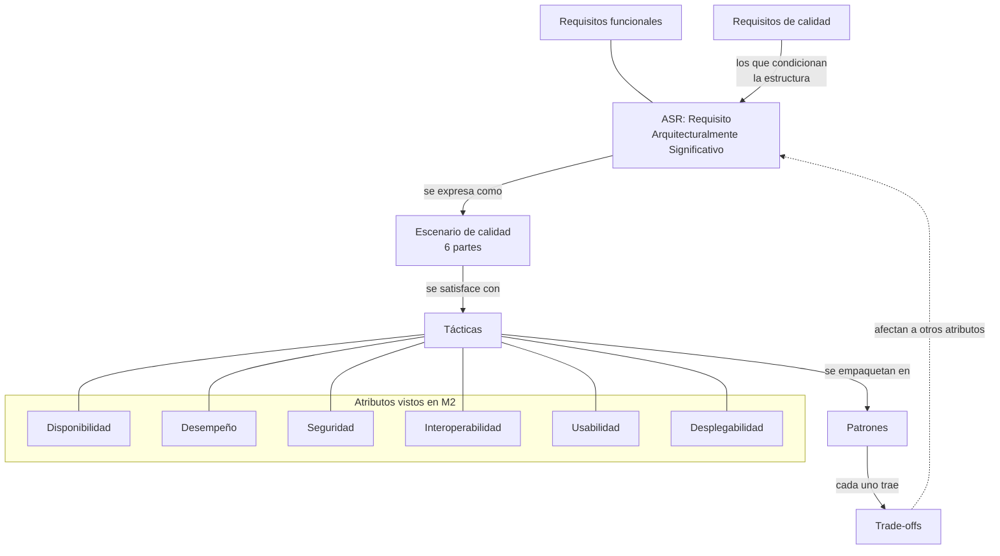

# Módulo 2 — Análisis de apertura

> **Autor:** Danny, con asistencia de IA · **Fecha:** 2026-09-30 · **Tipo:** `apunte` (con IA) — **no es material oficial**.
> **Fuentes:** `Material-Clase/Modulo2-Brightspace.md` y los 5 `Tacticas-*.md` (oficiales, solo texto) ·
> Bass, Clements, Kazman (citado por los propios decks) · resultados del Reto M1 del repo.
> **Etiquetas:** `[Curso]` está en el material · `[Compl.]` conocimiento complementario · `[Rec.]` recomendación de arquitecto.
> **Confianza:** Seguro / Probable / Suposición.

---

## 0. Lo incómodo primero

> **Actualización 30/09 (tarde):** ya se capturaron el enunciado del Reto 2 y los 4 Genially
> (`Material-Clase/Actividad-Reto2.md`, `Material-Clase/Genially-Contenidos-Obligatorios.md`).
> Esta versión **reemplaza** el plan preliminar anterior, que asumía un entregable documental.

**1. El Reto 2 es de implementación en AWS, no un documento, y hoy no tenemos cómo probarlo.** Hay que
construir un sistema que reciba 1000 eventos en 30 s y mande un correo por cada `Emergency`. El script
de k6 «se proporcionará» y **no lo tenemos**: sin él no sabemos qué proporción de eventos son
`Emergency`, y de eso depende el diseño (ver §5.3). *(Seguro que falta; el resto es Suposición.)*

**2. Hay dos rúbricas oficiales y no coinciden.** El PDF puntúa 2.5 de documentación + 2.5 por tiempo de
correo (total 5). La «Rúbrica M2» de Brightspace tiene **5 criterios** (diseño de la arquitectura,
implementación técnica y funcionalidad, documentación técnica, **pruebas y análisis de resultados**,
presentación y explicación), 1–5 puntos cada uno, y niveles de 0/5/8/11 puntos mínimos. Los
descriptores de cada celda vienen vacíos. Si se evalúa con la de Brightspace, **«pruebas y análisis de
resultados» pesa igual que el diseño** y el enunciado ni lo menciona como entregable. Preguntar el 06/10.
*(Seguro que difieren; Suposición sobre cuál manda.)*

**3. El feedback del profesor sobre M1 ahora es un criterio explícito de puntaje.** «Atributo de
calidad más importante: explicar cuál es y por qué fue priorizado» vale 0.5 en el PDF. Lo que faltó en
M1 se evalúa aquí. El entregable debe abrir con: *«Priorizamos X, por Y, a costa de Z.»* *(Seguro.)*

**4. Envío individual.** La carpeta de entrega es de usuario (`grpid=0`), sin grupo. M1 fue igual y el
equipo entregó un ZIP. `[Compl.]` Hay que acordar quién sube qué para no duplicar ni dejar a alguien sin
envío. No es una regla de Brightspace sino lo que muestra su URL. *(Probable.)*

**5. Falta el video de Seguridad** (5 min). Seguridad no es insumo directo del reto, pero queda un hueco.

## 1. Nivel de confianza global

| Bloque | Confianza |
|---|---|
| Contenido de tácticas de Disponibilidad, Desempeño, Seguridad, Desplegabilidad, Usabilidad | **Seguro** (texto literal de los decks; vienen de Bass et al. 4ª ed.) |
| ASRs, ADD e Interoperabilidad según el curso | **Seguro** (Genially capturados; ver la nota de que la transcripción es plana) |
| Enunciado y rúbrica del PDF del Reto 2 | **Seguro** (PDF oficial) |
| Rúbrica de Brightspace: criterios y niveles | **Seguro**; descriptores **desconocidos** |
| Análisis del Reto 2 (§5): comportamiento de servicios AWS | **Probable**: de conocimiento general, **sin probar** en la cuenta; cada punto lleva su etiqueta |
| Qué contiene la autoevaluación | **Suposición** (no se abrió) |
| Correcciones y críticas de la §3 | **Probable** salvo donde se indica |

---

## 2. Visión del módulo

### Objetivo `[Curso]` + `[Rec.]`

El M1 dijo *qué* es un atributo de calidad y que toda decisión es un trade-off. M2 baja un nivel:
**dado un atributo, qué decisiones concretas (tácticas) lo logran, y cómo se expresa el requisito de
forma medible (escenario de calidad)**. Es el paso de «quiero baja latencia» a «con pico de 500
usuarios, latencia acotada, y estas tres tácticas».

### Mapa conceptual

### ASR y método ADD según el curso `[Curso]` (Seguro — Genially P1)

- Un **ASR** es un requisito de calidad tan crítico que condiciona la arquitectura desde el inicio. No
  todos pesan igual: deben definirse **con claridad y priorizados**; unos se descartan según el
  contexto «pero nunca deben quedar sin analizar».
- Preguntas guía para identificarlo: actor, evento que lo dispara, circunstancias (¿carga máxima?, ¿en
  fallos?, ¿procesos simultáneos?), si es acción crítica o en tiempo real, qué atributos implica y qué
  elementos de la arquitectura afecta.
- **Regla de priorización del curso (ejemplo ping-pong):** un atributo tiene prioridad alta si el
  enunciado lo especificó (latencia); baja si no se explicitó (disponibilidad 90 %) o no se consideró
  (seguridad). Aun así se **documenta**.
- **ADD (Attribute-Driven Design), 7 pasos:** revisar entradas · fijar el objetivo de la iteración con
  drivers · elegir elementos a refinar · elegir conceptos de diseño (tácticas, patrones, referencias,
  componentes externos) · instanciar elementos, asignar responsabilidades y definir interfaces ·
  diagramar vistas y registrar decisiones (con justificación y trade-offs) · analizar el diseño
  (idealmente con otra persona) e iterar «dejando que el riesgo sea la guía».
- Los *drivers* son ASRs + funcionalidad + restricciones + preocupaciones + propósito de diseño.

### Las 6 partes del escenario de calidad `[Curso]` (Seguro)

Lo repiten los decks con la misma tabla. Es **la herramienta central del módulo** y probablemente
la del entregable. (El Genially P1 usa *Actor, Estímulo, Ambiente, Artefacto, Respuesta esperada*,
+ *Unidad* y *Prioridad*; es el mismo modelo con otros nombres. Usar uno solo en el entregable.)

| Parte | Pregunta | Ejemplo del deck (Desempeño) |
|---|---|---|
| Fuente | ¿Quién/qué origina el estímulo? | 500 usuarios |
| Estímulo | ¿Qué llega? | 2 000 solicitudes en 30 s |
| Artefacto | ¿Qué parte del sistema? | el sistema completo |
| Entorno | ¿En qué estado está? | condiciones normales |
| Respuesta | ¿Qué hace el sistema? | procesa todas las solicitudes |
| Medida de respuesta | ¿Cómo se verifica? | latencia promedio de 2 s |

> `[Rec.]` El ejemplo del deck usa **latencia promedio**. M1 ya demostró que el promedio esconde la
> cola: nuestro mejor caso tenía p50 de 83 ns y un máximo cientos de veces mayor. Un escenario bien
> hecho pide **percentil y entorno de carga**, no media.

### Tácticas por atributo `[Curso]` (Seguro)

| Atributo | Familias de tácticas | Patrones en el deck |
|---|---|---|
| **Disponibilidad** | Detectar (monitor, ping/echo, heartbeat, timestamp, sanity check, voting, excepciones, self-test) · Recuperar (repuesto redundante, rollback, reintento, degradación, reconfiguración, shadow, resincronización) · Prevenir (retiro del servicio, transacciones, modelo predictivo, prevención de excepciones) | Hot/warm/cold spare · TMR · **Circuit breaker** · process pairs |
| **Desempeño** | Controlar la demanda (acotar llegadas, priorizar, limitar respuesta, tiempos acotados, eficiencia) · Gestionar recursos (más recursos, **concurrencia**, copias de cómputo y de datos/caché, colas acotadas, planificación) | Service mesh · Load balancer · Throttling · Map-Reduce |
| **Seguridad** | Detectar · Resistir · Reaccionar · Recuperarse (la analogía del edificio físico) | Intercepting validator · IPS |
| **Desplegabilidad** | Gestionar el pipeline (scale rollouts, rollback, scripts) · Gestionar el sistema desplegado (interacciones entre versiones, empaquetar dependencias, **feature toggle**) | Microservicios · Blue/green · Rolling · Canary · A/B |
| **Usabilidad** | Iniciativa del usuario (cancelar, deshacer, pausar, agregar) · Iniciativa del sistema (modelos de tarea/usuario/sistema) | MVC · Observer · Memento |
| **Interoperabilidad** | *Discover services* · *Orchestrate* (control centralizado vs. descentralizado; monitoreo del flujo) · *Tailor interface* (transformación de datos, adaptadores, interfaces estandarizadas). Fuente: Genially P5, sin deck; ejemplo de un hospital con HL7 | — |

### Conocimientos previos

- **M1:** escenarios y medición (percentiles), trade-offs, restricciones. `[Curso]`
- **Defecto → error → falla** (Disponibilidad). Está definido en el deck: *detectar* = ver el defecto; *recuperar* = evitar que el error llegue a falla; *prevenir* = que no haya defecto.
- `[Compl.]` Cálculo de disponibilidad en serie y en paralelo: `A = MTBF/(MTBF+MTTR)`; una cadena de N componentes en serie multiplica sus disponibilidades. **El deck da la fórmula base, no la composición**; sin ella, «5 nueves» es una sigla.
- `[Compl.]` Sagas / consistencia eventual, implícita cuando el deck dice que los microservicios son «menos adecuados para transacciones complejas».

### Dónde se usa en un sistema real `[Rec.]`

| Táctica del curso | Dónde la verás |
|---|---|
| Circuit breaker, retry, timeout | Resilience4j en Spring Boot |
| Load balancer, throttling | Ingress/API Gateway en Kubernetes, rate limiting |
| Blue/green, rolling, canary | Deployments de Kubernetes, Argo Rollouts, Jenkins |
| Feature toggle | Lo que ya usas en Komet (Flipt/LaunchDarkly) |
| Caché (copias de datos) | Redis |
| Hot/warm/cold spare, DR | Las 4 lecturas de AWS: backup-restore, pilot light, warm standby, multi-site |

---

## 3. Errores y ambigüedades detectadas en el material

1. **«Seguridad» significa dos cosas (traducción).** Disponibilidad, lámina 4: «la disponibilidad
   está estrechamente relacionada con la seguridad, que se ocupa de evitar que el sistema entre en un
   estado peligroso». Esa frase describe **safety**, no **security**; el deck ya había relacionado la
   disponibilidad con la «seguridad» (security) por los DoS. Dos conceptos bajo una palabra.
   *(Probable; el deck es traducción automática de Bass.)*
2. **El 2PC como táctica de disponibilidad (Disp. lám. 35) es engañoso.** Las transacciones evitan
   inconsistencias, pero 2PC es bloqueante: si falla el coordinador, los participantes quedan
   esperando. En sistemas distribuidos suele *reducir* disponibilidad y por eso se prefieren sagas.
   Depende del contexto. *(Probable; `[Compl.]`.)*
3. **«Los tiempos de inactividad programados no cuentan» (Disp. lám. 7).** Es una convención
   contractual de muchos SLA, no una ley. Si el usuario no puede usar el sistema, para él no está
   disponible. Define qué cuenta como *downtime* antes de dar el número. *(Probable.)*
4. **«Alta disponibilidad = 5 nueves o más» (lám. 8).** Es una de varias convenciones; en la práctica
   se habla de HA desde 99,9 % o 99,99 %. Lo que importa es el costo de cada nueve. *(Probable.)*
5. **Service mesh «reduce la latencia» (Desemp. lám. 35) y luego lista el overhead del sidecar como
   trade-off.** Es cierto *frente a* servicios de utilidad remotos compartidos, pero un sidecar añade
   un salto frente a una librería en proceso. La ganancia es relativa a una alternativa concreta. *(Probable.)*
6. **Blue/green vs rolling: tensión interna (Desplieg. lám. 29 vs 36).** La 29 dice que las azules se
   eliminan «solo después» de validar; la 36 dice que un error latente puede aparecer cuando ya se
   borraron. Ambas son ciertas: depende de **cuánto tiempo conservas el ambiente azul**. Esa es la
   decisión real y no aparece como tal. *(Seguro que son compatibles.)*
7. **Láminas sin texto.** «Tipos de Pruebas» (Desemp. lám. 54), los escenarios generales de
   Disponibilidad (lám. 12) y de Desplegabilidad (lám. 10) son imágenes: no sé qué contienen. *(Seguro.)*
8. **Dos taxonomías en juego.** M1 usó ISO/IEC 25010; M2 usa la de Bass, con *desplegabilidad* e
   *interoperabilidad* como atributos propios. En ISO 25010 la interoperabilidad cae dentro de
   *compatibilidad* y la desplegabilidad no es característica de primer nivel. `[Compl.]` No mezclar
   términos en un entregable. *(Probable.)*
9. **Desalineación temario ↔ recursos.** Contenidos obligatorios y Conclusiones cubren 4 atributos
   (disponibilidad, desempeño, seguridad, interoperabilidad); Recursos complementarios aportan 5 decks,
   dos sobre temas que *no* figuran ahí (Usabilidad, Desplegabilidad) y ninguno sobre Interoperabilidad,
   que solo existe en el Genially P5. El reto no usa ninguno de esos dos. Preguntar qué se evalúa.
   *(Seguro que hay desalineación; Suposición sobre la evaluación.)*
10. **Dos rúbricas oficiales para el Reto 2** (PDF vs. «Rúbrica M2» de Brightspace): ver §0.2. *(Seguro.)*
11. **Material sin terminar en P5:** el Genially trae el marcador «AQUí va la imagen» (×2) y un bloque
    de ADD pegado que no pertenece a interoperabilidad. *(Seguro.)*
12. **La rúbrica del PDF se titula «Reto 1»** y llama «demostración en vivo» al puntaje del tiempo de
    correo; además el objetivo dice < 30 s pero los cortes son 15 y 45 s. *(Seguro.)*

---

## 4. Conexión con M1 — y el hilo conductor que faltó

**Lo que sabemos de M1:** el reto fue puro **Desempeño** (latencia < 1 ms). El informe midió TCP con
p50 del orden de 15 µs y memoria compartida en C con p50 de 83 ns. *(Verificar cifras exactas contra
`Modulo 1/Ejercicios/Reto-Latencia-Minima/` antes de citarlas.)*

**Lo que M2 permite decir y faltó en M1 (el feedback del profesor):** cada ganancia de desempeño se
pagó en otros atributos. Estructura recomendada para *cualquier* entregable o exposición:

| Decisión (M1) | Atributo priorizado | A costa de | Táctica del M2 que lo nombra |
|---|---|---|---|
| Memoria compartida en vez de TCP | Desempeño | **Disponibilidad** (host y proceso compartidos: sin aislamiento de fallas), **Seguridad** (sin frontera de red), **Desplegabilidad** (no se despliegan por separado) | *Coubicar recursos* (Desemp.) vs *Entidades separadas* (Seg.) y *Microservicios* (Desplieg.) |
| TCP/HTTP | Interoperabilidad y operabilidad | Desempeño (órdenes de magnitud más latencia) | *Load balancer*, *Mantener copias* |

> `[Rec.]` Esta tabla, hecha *antes* de la sustentación, era el hilo conductor. Para M2, hazla
> **primero** y deriva el resto de ella, no al final como justificación.

---

## 5. Análisis del Reto 2 — alerta temprana de flota vehicular

> `[Rec.]` + `[Compl.]`. Lo de AWS es conocimiento general **sin probar en la cuenta** (Probable). Los
> números del enunciado son `[Curso]`. Es una **propuesta para que el equipo decida**, no una decisión.

### 5.1 Los ASRs del reto, con el formato del curso

| # | Atributo | Escenario (fuente → estímulo → entorno → respuesta → medida) | Prioridad según la regla del curso |
|---|---|---|---|
| A1 | **Latencia de la alerta** (desempeño) | Vehículo/k6 → llega un `Emergency` → durante 1000 eventos en 30 s → el sistema envía el correo → **< 15 s** desde el último envío de k6 (2.5 pts; el enunciado dice < 30 s) | Alta: especificada y puntuada |
| A2 | **No pérdida / disponibilidad de ingesta** | k6 → 1000 peticiones → a ~35 rps → el endpoint acepta todas → **100 %** con HTTP 200, 0 fallos | Alta: especificada («100 %») |
| A3 | **Restricciones** | — | Duras: 15 rps en API Gateway, ≤ 10 instancias simultáneas, Gmail |
| A4 | **Observabilidad** | Sistema → recibe `Emergency` y envía correo → siempre → registra hora exacta de ambos → logs verificables | Alta: entregable explícito |
| A5 | Seguridad, interoperabilidad, usabilidad, desplegabilidad | No especificados | Baja: **documentar como no priorizados** (regla del Genially P1) |

### 5.2 Propuesta del «atributo más importante» (0.5 pts y hilo conductor)

**Hipótesis para discutir:** *«Priorizamos el **desempeño** —latencia extremo a extremo de la alerta—
porque es lo que la rúbrica puntúa de forma graduada (2.5 / 1.5 / 0.5), con la **no pérdida de
eventos** como restricción dura, a costa de **costo y simplicidad operativa** (más servicios) y de
aceptar **entrega al-menos-una-vez**, es decir, un correo duplicado es posible.»*

- **Por qué no «disponibilidad» como principal:** el enunciado la pide como «100 % procesadas» en una
  prueba de 30 s, no como porcentaje sostenido en el tiempo. Es un umbral que se cumple o no; el
  tiempo del correo es lo que separa 2.5 de 0.5. *(Probable.)*
- **Contra-argumento honesto:** el mensaje de bienvenida del módulo dice «priorizando atributos como
  el rendimiento **y** la disponibilidad». Si el equipo prefiere decir *disponibilidad*, es defendible;
  lo que no es defendible es no elegir. *(Seguro que dice ambos.)*
- **Tensión real:** una cola da durabilidad (A2) pero añade latencia (A1). La decisión de fondo del
  reto es *cuánta latencia pagas por no perder eventos*. Ese es el trade-off que hay que mostrar.

### 5.3 Dos cuentas que condicionan el diseño (hacerlas antes de elegir servicios)

**(a) Tasa: 15 rps contra ≈ 35 rps.** API Gateway limita con *token bucket* (rate = recarga, burst =
cubo). *(Seguro.)* En 30 s el rate aporta ≈ 450 tokens; para admitir 1000 sin rechazos el burst debe
cubrir ≈ 550 o más, y más si el k6 carga al inicio. El enunciado dice «burst por defecto» pero su
imagen muestra **2000**. **Verificar el valor real en nuestra cuenta antes de diseñar;** si fuera
menor, los rechazos (429) rompen A2 y ningún procesador lo arregla. *(Cálculo Seguro; el valor por
defecto, Suposición.)*

**(b) Concurrencia: ley de Little, `concurrencia ≈ llegadas/s × duración`.** El k6 de referencia muestra
35.7 req/s y ~176 ms: ≈ 6.4 simultáneas, bajo el tope de 10. *(Cálculo Seguro.)* Pero **si el handler
también llama al envío de correo** (cientos de ms, Suposición), a 0.5 s por petición son ≈ 18 > 10, y
con un límite de 10 las sobrantes se rechazan (A2 falla). Conclusión de arquitectura: **el camino
síncrono que responde al cliente no puede esperar al correo.** *(Probable.)*

### 5.4 Opciones de arquitectura

| Opción | Esquema | A favor | En contra | Cuándo elegirla |
|---|---|---|---|---|
| **A. Síncrona** | API GW → Lambda (detecta + envía correo) → 200 | Mínima latencia y piezas | Viola §5.3(b): el correo consume concurrencia; sin búfer, un fallo del envío pierde el evento | Solo si los `Emergency` son muy pocos |
| **B. Cola + consumidor** | API GW → SQS (integración directa) → Lambda ≤ 10 → correo | Desacopla; durable; absorbe el pico; ingesta no consume instancias | Latencia extra (sondeo de la cola), más servicios, posibles duplicados | **Recomendada para A2**, si la latencia extra cabe en < 15 s (medir) |
| **C. Dos caminos** | API GW → Lambda barata que responde 200; solo si `Emergency` publica a SQS/SNS → correo; `Position` se registra y termina | Camino rápido para lo crítico; el pico de `Position` no toca el envío | Más lógica en la ingesta; el Lambda de ingesta sí consume concurrencia (afinable) | **Recomendada para A1+A2** si hay muchos `Position` y pocos `Emergency` |
| **D. Contenedores** | ALB → ECS/Fargate ≤ 10 tareas | Sin cold start; control total | Más operación y costo; escala más lenta que Lambda | Si el cold start resultara inaceptable al medir |

`[Rec.]` Empezar por **C**, medir, y volver a **B** solo si la latencia lo permite. No empezar por D: es
la opción con más piezas para un problema de 30 s. Evitar sobreingeniería (Kafka, Step Functions, etc.):
**ninguna está justificada por un ASR.**

**Tácticas del curso que quedarían en el diseño** (para la rúbrica de tácticas, 1.0): *acotar
llegadas / throttling* (API GW) · *concurrencia* y *límites de instancias* (desempeño) · *colas
acotadas* · *priorizar eventos* (Emergency antes que Position) · *reintento* y *cola de mensajes
fallidos* (disponibilidad) · *monitor/heartbeat*/logs (detección). Cada una con su costo nombrado.

### 5.5 Riesgos que hay que resolver pronto (algunos tienen plazo)

1. **Correo = dependencia externa con plazo.** Amazon SES arranca en *sandbox*: solo envía a
   destinatarios verificados y con cuotas bajas; salir del sandbox pide una solicitud que puede tardar.
   Como el destinatario es nuestro Gmail, *verificar la identidad basta para la demo*, pero la **cuota de
   envío por segundo** puede dominar la latencia si hay muchos `Emergency`. *(Probable.)* **Empezar el
   trámite ya.**
2. **Proporción de `Emergency` en el k6: desconocida.** Decide si A1 se cumple y si hay que enviar un
   correo por evento o agrupar. «Enviar un correo cuando se detecte un `Emergency`» parece **uno por
   evento**; preguntarlo. *(Seguro que no lo sabemos.)*
3. **Medición del tiempo.** Mide «último envío de k6 → recepción del correo»: incluye la entrega de Gmail
   (fuera de nuestro control). Nuestros logs solo prueban hasta el envío. *(Seguro.)*
4. **Cold start** en las primeras peticiones; puede afectar A1 y A2. Medir antes de gastar en mitigarlo.
5. **Duplicados** por entrega al-menos-una-vez: decidir si se toleran o se hace idempotencia por id de evento.
6. **Costo:** cuenta personal de AWS; poner presupuesto/alarma antes de cargar 1000 peticiones varias veces.

### 5.6 Pruebas y análisis de resultados (criterio de la rúbrica de Brightspace)

Aunque el PDF no lo pide, la rúbrica de Brightspace lo puntúa. Propuesta: ≥ 5 corridas del k6;
por corrida registrar **fallos HTTP, 429, p95, tiempo hasta el correo, cold starts**, con un
identificador de correlación en ambos logs; una tabla **antes/después** de cada decisión (p. ej. C vs
B). Sin medición propia no hay «análisis». *(Probable.)* Consistente con la lección de M1 (percentil, no promedio).

### 5.7 Plan y calendario (fechas oficiales: encuentros 06/10 y 13/10 a las 6 pm, cierre 20/10)

| Cuándo | Qué |
|---|---|
| 30/09 – 02/10 | Verificar burst real, iniciar identidad SES, **pedir el k6**, acordar el atributo prioritario (§5.2) |
| **06/10** | Encuentro 1: llevar las preguntas de §0 (dos rúbricas, k6, modalidad del envío, uno por evento) |
| 07/10 – 11/10 | Implementar la opción C; ADR del atributo; diagrama |
| 12/10 | Primera medición (§5.6) |
| **13/10** | Encuentro 2: validar con el profesor |
| 14/10 – 18/10 | Ajustes, logs finales, documento, video o presentación |
| 19/10 | Entrega; **margen de un día** (después del cierre no se califica) |

**Reparto sugerido, a decidir por el equipo:** infraestructura AWS · código del handler y logs ·
documento técnico, ADR y diagrama. El video/demo y la autoevaluación los hace cada uno. La
**autoevaluación no se abre** hasta que se acuerde (en M1 fue de un solo intento).

## 6. Preguntas que deberías poder responder al cerrar el módulo

1. ¿Qué convierte a un requisito en **arquitecturalmente significativo**? *(Genially P1: condiciona la estructura desde el inicio; se identifica con las preguntas guía y se prioriza según lo que el enunciado especifica.)*
2. Escribe un escenario de calidad completo (6 partes) para «el checkout no debe caerse en Black Friday».
3. Diferencia defecto, error y falla con un ejemplo real.
4. ¿Por qué `Retry` sin `Circuit breaker` puede empeorar una caída? ¿Y un circuit breaker con timeout mal configurado?
5. Hot, warm y cold spare: costo, tiempo de recuperación y cuándo cada uno.
6. Blue/green vs rolling vs canary: recursos, rollback, riesgo de inconsistencia entre versiones.
7. Si priorizaste *Desempeño*, nombra tres tácticas de otros atributos que sacrificaste y cómo lo justificas.
8. ¿Qué tácticas de Seguridad aplican a un sistema público y cuáles a uno interno?
9. ¿Por qué un feature toggle es táctica de *desplegabilidad* y también de *disponibilidad*?
10. ¿Cómo se relaciona la disponibilidad con *security* y con *safety*? *(Ver §3.1.)*

---

## 7. Autoreview

- ASRs e Interoperabilidad ya vienen del material oficial capturado. Lo que sigue como Suposición es el comportamiento de AWS (§5) y la autoevaluación.
- §5 es una **propuesta** y debe tratarse como tal en el consolidado; no hay un diseño validado ni medido.
- El aporte anterior (plan documental) quedó reemplazado; el historial está en git si se necesita.
- Las críticas de la §3 son mías (`[Compl.]`/`[Rec.]`): llevarlas al encuentro como **preguntas**, no como correcciones.
