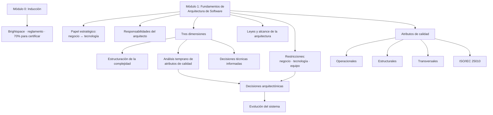
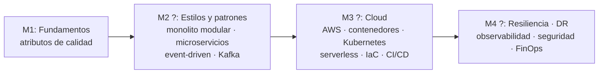

# Mapa conceptual acumulativo

> Actualizado: 2026-09-08 (tras Módulo 1).
> **[CURSO]** = confirmado en el material · **[HIPÓTESIS]** = predicción para preparar terreno.

## Confirmado — Módulo 0 + Módulo 1

## Conceptos recurrentes (aparecen en ≥2 lugares)

| Concepto | Dónde aparece |
|---|---|
| **Latencia / rendimiento** | M1 temario (atributos operacionales) · M1 actividad (reto < 1 ms) |
| **Seguridad** | M1 temario (transversales) · M1 complementarios (OWASP, CWE, SAFECode, SAST/DAST) |
| **Mantenibilidad** | M1 temario (estructurales) · M1 conclusiones |
| **Disponibilidad / resiliencia** | M1 conclusiones · M1 complementarios (DR en AWS ×4, Netflix HA, Circuit Breaker) |
| **Trade-offs** | Prompt maestro · primera ley de la arquitectura (M1) |

## Hipótesis de recorrido — módulos 2 a 4 **[HIPÓTESIS]**

Los 14 recursos complementarios del M1 son la mejor pista disponible: se agrupan en
**resiliencia/DR (AWS)**, **estrategias de despliegue** y **seguridad**. Sumado al perfil del
docente (AWS, Kafka, Kubernetes, event-driven, banca):

**No confirmado.** Los temarios de los módulos 2–4 no están publicados.
